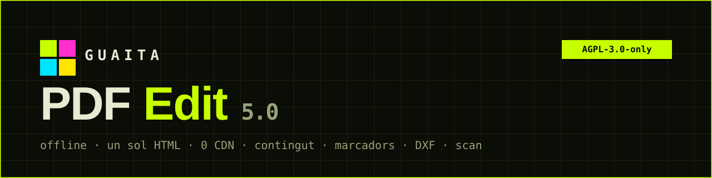

<!-- SPDX-License-Identifier: AGPL-3.0-only · Copyright (c) 2026 SBS BiM Consulting, Jordi Subirós -->

<b>🇨🇦 <a href="#català">Català</a></b> · <b>🇬🇧 <a href="#english">English</a></b>

---

## Català

**Guaita PDF Edit** és un editor de PDF multidocument en **un sol fitxer HTML**: no instal·la res, no es connecta a cap servidor i funciona sense Internet. Els teus PDF no surten mai de l'ordinador. Forma part de la suite **Guaita Apps**.

### Funcions

| | |
|---|---|
| 📄 **Pàgines** | Reordena, gira, duplica, extreu, elimina, insereix; copia/enganxa entre documents; fusiona pestanyes |
| 👁 **Vistes** | Pàgina única, llibre, continu i continu en dues columnes; miniatures redimensionables |
| ✍ **Anotacions** | Llapis, ressaltador, text, formes, signatura, imatges, marca d'aigua, numeració, mesura a escala |
| ✎ **Contingut original** | Edita text amb la font incrustada, **combina** lletres originals amb una font de reemplaçament, i elimina/substitueix/mou imatges |
| 🔖 **Marcadors** | Lectura, creació, edició, arrossegar i niar, navegació, panell lateral; es desen dins el PDF |
| 📐 **Exporta a DXF** | Geometria vectorial → DXF R12, capes per color, unitats i escala calibrable (sense dependre de cap altra app) |
| 🛡 **guaitaPDFscan** | Analitza i desarma un PDF sospitós en una finestra aïllada; l'editor només rep el PDF net |
| 🖨 **Impressió** | Previsualització amb paper, orientació i escala (com Acrobat) |
| 🌐 **Idiomes** | Català i anglès |

### Fitxers

| Fitxer | Ús |
|---|---|
| `guaita_pdf_edit_5.0.html` / `_EN.html` | Mode pestanya (obre al navegador) |
| `guaita_pdf_edit_5.0_app.html` / `_EN_app.html` | Mode app (sense barra d'adreces) |
| `guaitaPDFscan_1.1.html` / `_1.1_EN.html` | Analitzador; **ha de ser a la mateixa carpeta** |
| `Obrir_Guaita_PDF_Edit_app.bat` / `.command` | Llançadors mode app (Windows / macOS-Linux) |

### Ús

1. Descarrega els fitxers a **una mateixa carpeta**.
2. Fes doble clic a `guaita_pdf_edit_5.0.html`, o usa un llançador per al mode app.
3. Obre o arrossega un o diversos PDF.

Per a l'analitzador, el navegador ha de permetre finestres emergents. També es pot servir per **GitHub Pages** (fitxers estàtics, HTTPS, editor i analitzador al mateix directori).

📘 **Manual complet:** [`HLP guaitaPDFedit-ajuda.html`](HLP%20guaitaPDFedit-ajuda.html)

### Limitacions conegudes

La navegació de marcadors va a la pàgina (no a la posició exacta); «Insereix des de PDF» no importa marcadors; el DXF no exporta imatges ni degradats.

---

## English

**Guaita PDF Edit** is a multi-document PDF editor in **a single HTML file**: it installs nothing, talks to no server and works offline. Your PDFs never leave your computer. Part of the **Guaita Apps** suite.

### Features

| | |
|---|---|
| 📄 **Pages** | Reorder, rotate, duplicate, extract, delete, insert; copy/paste across documents; merge tabs |
| 👁 **Views** | Single page, book, continuous and two-column continuous; resizable thumbnails |
| ✍ **Annotations** | Pencil, highlighter, text, shapes, signature, images, watermark, page numbers, scaled measuring |
| ✎ **Original content** | Edit text with the embedded font, **combine** original letters with a replacement font, delete/replace/move images |
| 🔖 **Bookmarks** | Read, create, edit, drag and nest, navigate, side panel; saved inside the PDF |
| 📐 **Export to DXF** | Vector geometry → DXF R12, colour layers, units and calibrated scale (no other app needed) |
| 🛡 **guaitaPDFscan** | Analyse and disarm a suspicious PDF in an isolated window; the editor only receives the clean PDF |
| 🖨 **Print** | Preview with paper, orientation and scale (Acrobat-style) |
| 🌐 **Languages** | Catalan and English |

### Files

| File | Use |
|---|---|
| `guaita_pdf_edit_5.0.html` / `_EN.html` | Tab mode (opens in the browser) |
| `guaita_pdf_edit_5.0_app.html` / `_EN_app.html` | App mode (no address bar) |
| `guaitaPDFscan_1.1.html` / `_1.1_EN.html` | Analyser; **must be in the same folder** |
| `Open_Guaita_PDF_Edit_app_EN.bat` / `.command` | App-mode launchers (Windows / macOS-Linux) |

### Usage

1. Download the files into **one folder**.
2. Double-click `guaita_pdf_edit_5.0_EN.html`, or use a launcher for app mode.
3. Open or drop one or more PDFs.

The analyser needs the browser to allow pop-ups. It can also be served via **GitHub Pages** (static files, HTTPS, editor and analyser in the same directory).

📘 **Full guide:** [`HLP guaitaPDFedit-help_EN.html`](HLP%20guaitaPDFedit-help_EN.html)

### Known limitations

Bookmark navigation goes to the page (not the exact position); “Insert from PDF” does not import bookmarks; DXF export skips images and shadings.

---

## Components · Llicència · Licence

[pdf.js](https://mozilla.github.io/pdf.js/) 3.11.174 (Apache-2.0) · [pdf-lib](https://pdf-lib.js.org/) 1.17.1 (MIT) · [@pdf-lib/fontkit](https://github.com/Hopding/fontkit) 1.1.1 (MIT) — tots incrustats / all embedded.

Copyright © 2026 **SBS BiM Consulting, Jordi Subirós** · `SPDX-License-Identifier: AGPL-3.0-only`

> Guaita Apps es distribueix «tal com és», sense cap garantia. / Guaita Apps is distributed “as is”, without any warranty.
